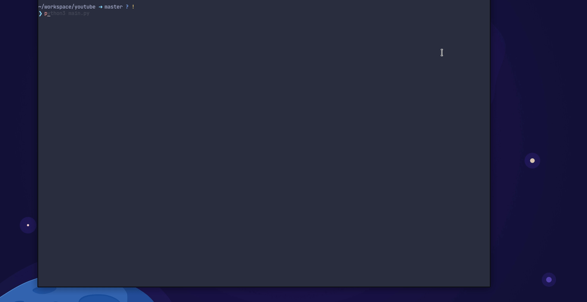

# 
Crappy

	<a href="https://nvchad.github.io/">Requirements</a>
   • 
    	<a href="https://nvchad.github.io/quickstart/install">Install</a>
   • 
       	<a href="https://nvchad.github.io/contribute">Contribute</a>
   • 
	<a href="https://github.com/NvChad/NvChad#gift_heart-support">Usage</a>

 
 

  

 

## Screenshots

