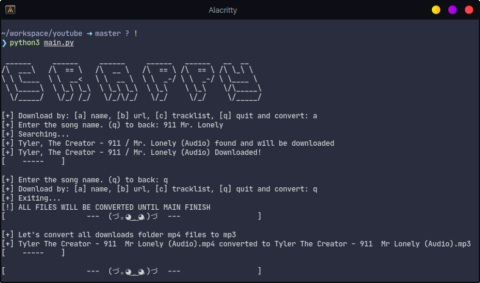

# <div align="center">Crappy</div>

<div align="center">Crappy is a based python script to download music on MP3 from YouTube.</div>
<br>

<div align="center">
  
</div>
<br>

### Authors
- [@ErickAvilaB](https://www.github.com/ErickAvilaB)

### Screenshot


### Installation
This app require [Pytube](https://pytube.io/en/latest/index.html).

Create and activate a virtual environment to avoid problems with another projects of your PC, then clone repo and install requirements.

**To install:**
```bash
# Create virtual environment and activate it
  mkdir crappy
  cd crappy
  python3 -m venv venv
  source venv/bin/activate

# Clone project
  git clone https://github.com/ErickAvilaB/youtube-downloader.git

# Install requirements
  pip install -r requirements.txt
```
### Usage
To use Crappy just is necessary run `crappy/src/main.py` file. Make sure you have ran the script one time before because that will create the necessary files to work, like `downloads` folder or `list.txt` which is necessary for download by track list. **Your downloads will be saved in `crappy/src/downloads` folder.**

#### Examples
##### Download a song by name or url.
```bash
~/workspace/youtube/src ➜ master ? ! —
❯ python3 main.py

 ______     ______     ______     ______   ______   __  __
/\  ___\   /\  == \   /\  __ \   /\  == \ /\  == \ /\ \_\ \
\ \ \____  \ \  __<   \ \  __ \  \ \  _-/ \ \  _-/ \ \____ \
 \ \_____\  \ \_\ \_\  \ \_\ \_\  \ \_\    \ \_\    \/\_____\
  \/_____/   \/_/ /_/   \/_/\/_/   \/_/     \/_/     \/_____/

[+] Download by: [a] name, [b] url, [c] tracklist, [q] quit and convert: a
[+] Enter the song name. (q) to back: King Kunta
[+] Searching...
[+] Kendrick Lamar - King Kunta found and will be downloaded
[+] Kendrick Lamar - King Kunta Downloaded!
[    -----    ]

[+] Enter the song name. (q) to back: q
[+] Download by: [a] name, [b] url, [c] tracklist, [q] quit and convert: q
[+] Exiting...
[!] ALL FILES WILL BE CONVERTED UNTIL MAIN FINISH
[                   ---  (づ｡◕‿‿◕｡)づ  ---                  ]

[+] Let's convert all downloads folder mp4 files to mp3
[+] ads/Kendrick Lamar - King Kunta.mp4 converted to ads/Kendrick Lamar - King Kunta.mp3
[    -----    ]

[                   ---  (づ｡◕‿‿◕｡)づ  ---                  ]
```
Watch [gift](./assets/screen2.gif)

##### Download by track list
To download by track list use the `crappy/src/list.txt` file, put your songs into the file before run the script then just set the *download by track list* option.

list.txt example.
```
Dark Fantasy - Kanye West
Gorgeous - Kanye West
Power - Kanye West

```

Download process.
```bash
~/workspace/youtube/src ➜ master ? ! —
❯ python3 main.py

 ______     ______     ______     ______   ______   __  __
/\  ___\   /\  == \   /\  __ \   /\  == \ /\  == \ /\ \_\ \
\ \ \____  \ \  __<   \ \  __ \  \ \  _-/ \ \  _-/ \ \____ \
 \ \_____\  \ \_\ \_\  \ \_\ \_\  \ \_\    \ \_\    \/\_____\
  \/_____/   \/_/ /_/   \/_/\/_/   \/_/     \/_/     \/_____/

[+] Download by: [a] name, [b] url, [c] tracklist, [q] quit and convert: c
[+] Searching...
[+] Dark Fantasy found and will be downloaded
[+] Dark Fantasy Downloaded!
[    -----    ]

[+] Searching...
[+] Gorgeous found and will be downloaded
[+] Gorgeous Downloaded!
[    -----    ]

[+] Searching...
[+] Kanye West - POWER found and will be downloaded
[+] Kanye West - POWER Downloaded!
[    -----    ]

[+] Download by: [a] name, [b] url, [c] tracklist, [q] quit and convert: q
[+] Exiting...
[!] ALL FILES WILL BE CONVERTED UNTIL MAIN FINISH
[                   ---  (づ｡◕‿‿◕｡)づ  ---                  ]

[+] Let's convert all downloads folder mp4 files to mp3
[+] ads/Kanye West - POWER.mp4 converted to ads/Kanye West - POWER.mp3
[    -----    ]

[+] ads/Gorgeous.mp4 converted to ads/Gorgeous.mp3
[    -----    ]

[+] ads/Dark Fantasy.mp4 converted to ads/Dark Fantasy.mp3
[    -----    ]

[                   ---  (づ｡◕‿‿◕｡)づ  ---                  ]
```
Watch [gift](./assets/list.gif)

## Contributing

Contributions are always welcome!
